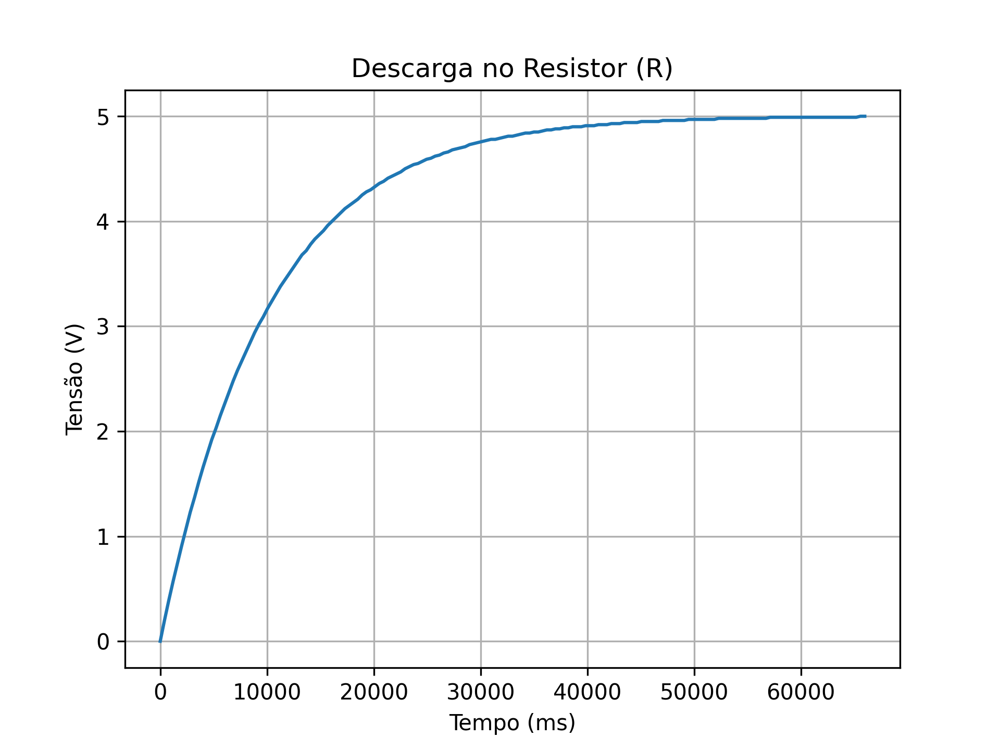
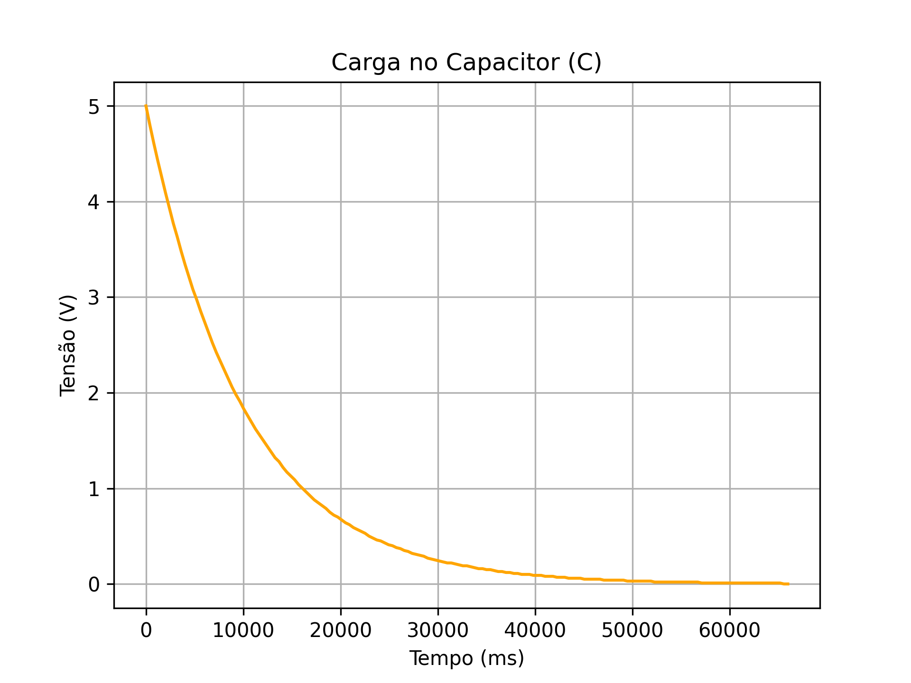
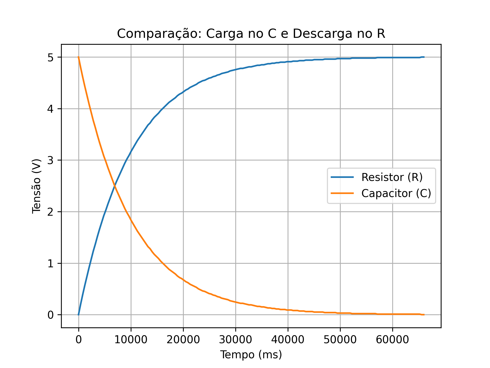

# Projeto – Carga e Descarga de um Capacitor

Este projeto demonstra o comportamento de um circuito RC (Resistor–Capacitor) durante os processos de **carga** e **descarga**.

## TinkerCad

O link a seguir mostra o funcionamento do circuito no **Tinkercad**, incluindo a operação completa do circuito e do **slide switch**:

🔗 [Veja à simulação no Tinkercad](https://www.tinkercad.com/things/l4P0aHsahoc/editel?returnTo=%2Fdashboard%2Fdesigns%2Fcircuits)

## Gráficos Gerados

A partir dos dados obtidos experimentalmente (`dados_carga.txt`), foram gerados os seguintes gráficos:

1. **Descarga no Resistor**
   

2. **Carga no Capacitor**
   

3. **Comparação entre Resistor e Capacitor**
   

## Código em Python

O processamento dos dados e a geração dos gráficos foram realizados com o script:

📁 [`processar_dados.py`](processar_dados.py)

## Resultados
Os resultados mostram o comportamento esperado do circuito RC:
- A **tensão no capacitor** aumenta exponencialmente durante a carga e decresce durante a descarga;
- A **tensão no resistor** apresenta comportamento inverso, validando o modelo teórico do circuito.